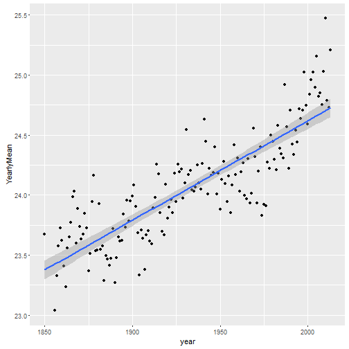

# Climate Change App

---  
 
## Introduction

1. What is _it_?
2. What does it _do_?
3. Where can I _find_ it?

---

## What is it?

The ClimateChange app displays information on yearly temperature changes across all the continents as early as the year 1750!

---

## What does it do?

It draws pretty graphics such as.

---

## Where can I find it?

I'm glad you asked, because you can find it at [THIS]( https://sndekoning.shinyapps.io/ClimateChange-App/) link!

I hope you enjoy!

